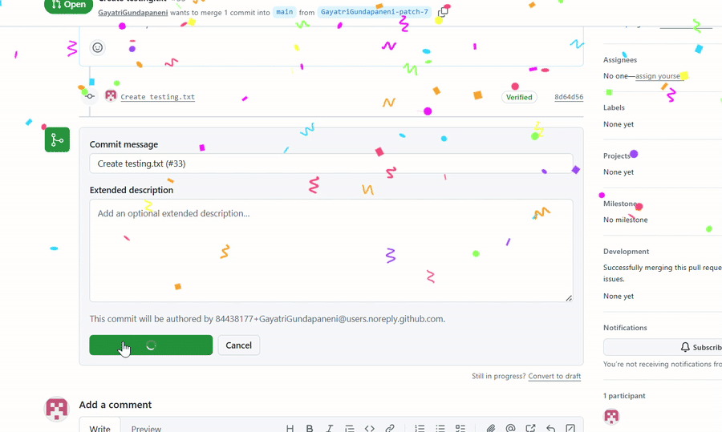

# 🎉 Mergefetti

**Your pull request merges deserve a celebration.** Mergefetti rains confetti across your screen the moment a PR is merged on GitHub — on github.com *and* your company's GitHub Enterprise instance.

---

## Why I built this

Merging a pull request is a small win — you shipped something, you closed the loop, maybe you ended a week of back-and-forth review. But GitHub marks the moment with a quiet little "Merged" label and nothing else. It felt joyless.

So I made the moment feel like the moment. Click confirm, and your screen throws a party.

## What it does

- 🎯 **Fires at the right instant** — only when a merge is actually *confirmed*, not when you open the merge dialog and back out.
- 🧩 **Handles every merge style** — merge, squash & merge, rebase & merge, and admin bypass merges.
- 🏢 **Works on GitHub Enterprise** — runs on `github.com` and your organization's self-hosted GitHub instance, so the celebration follows you to work.
- 🪶 **Tiny and self-contained** — no accounts, no tracking, no network calls. Just confetti.

## Install

**Microsoft Edge** — [get it from the Edge Add-ons store](https://microsoftedge.microsoft.com/addons/detail/mergefetti/hppkehllnogloaflielncpiehokafbhi)

**Edge (manual / developer mode):**

1. Download this repo (green **Code** button → **Download ZIP**) and unzip it.
2. Go to `edge://extensions`
3. Turn on **Developer mode** (toggle, top-right or bottom-left).
4. Click **Load unpacked** and select the unzipped folder.
5. Open any GitHub PR and merge it. 🎉

**Chrome extension: Coming soon!! 😁**

## How it works

A lightweight content script watches for the final **"Confirm … merge"** button click on any GitHub page. When it detects a true merge confirmation, it triggers a confetti animation powered by [`canvas-confetti`](https://github.com/catdad/canvas-confetti). That's the whole trick — no permissions beyond reading the page, no data leaves your browser.
